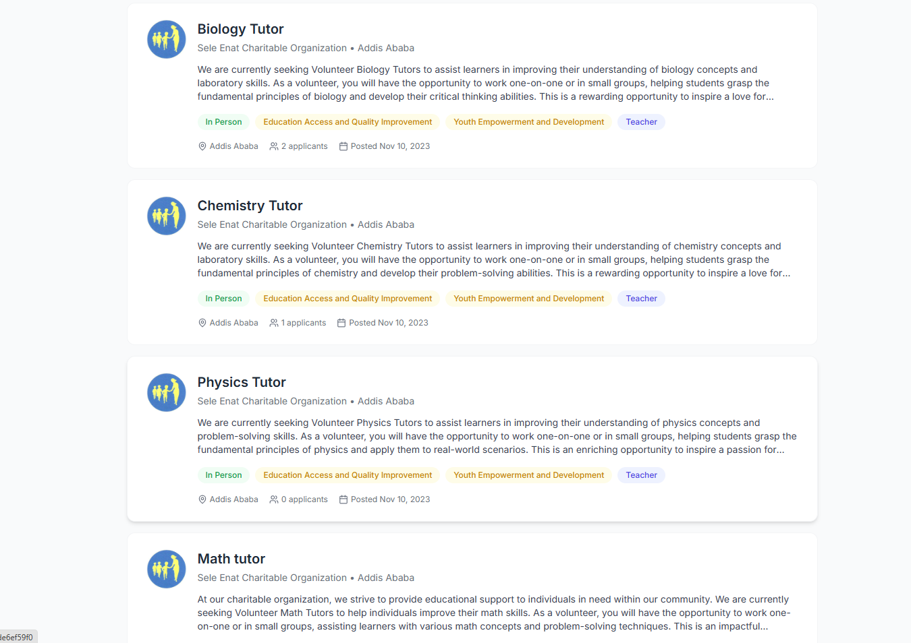
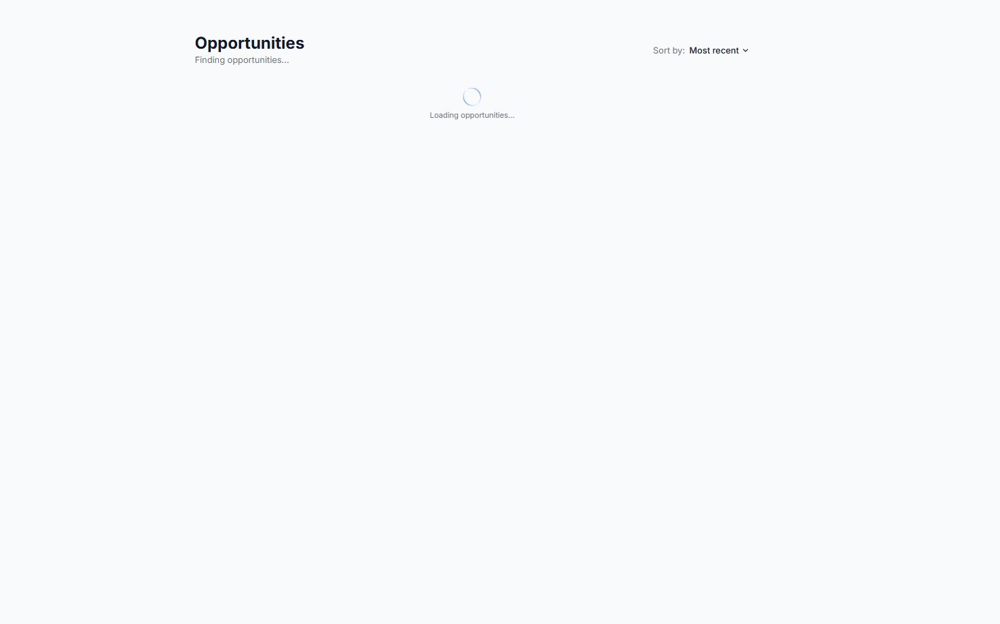
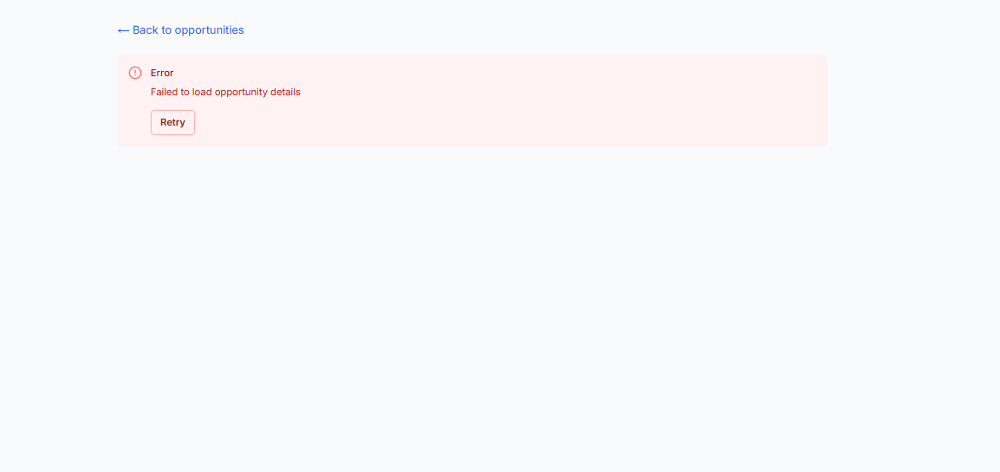

# Job Listing Application

A modern, responsive job listing application built with Next.js, Tailwind CSS, and RTK Query. This application allows users to browse job opportunities, view detailed job descriptions, and filter jobs by various criteria.

## Features

- Fetch real job opportunities from an API
- Display job listings with clean, modern UI
- View detailed job descriptions
- Handle loading states and errors gracefully
- Responsive design that works on mobile, tablet, and desktop

## Screenshots

### Home Page

The home page displays a list of all available job opportunities with a clean, card-based layout. Each job card shows:

- Company logo
- Job title
- Company name and location
- Brief job description
- Tags for job categories and type
- Applicant count and posting date

### Job Detail Page

The job detail page provides comprehensive information about a specific job opportunity:

- Full job description
- Responsibilities
- Requirements
- Ideal candidate profile
- When and where information
- About section with dates, location, and other details
- Categories and required skills

### Loading States

The application shows loading indicators when fetching data from the API.

### Error Handling

The application handles errors gracefully, showing error messages and providing retry options.

## Technical Implementation

### API Integration

The application uses RTK Query to fetch data from the API endpoints:

- `/opportunities/search` - Get all opportunities
- `/opportunities/:id` - Get a specific opportunity by ID

### Components

- **OpportunitiesList**: Displays a list of all opportunities
- **OpportunityCard**: Displays a summary of an opportunity in a card format
- **ErrorMessage**: Shows error messages with retry functionality
- **Spinner**: Displays loading indicators

### Data Flow

1. The application fetches data from the API using RTK Query
2. The data is cached in the Redux store
3. Components access the data using the generated hooks
4. Loading states and errors are handled appropriately

## Getting Started

1. Clone the repository
2. Install dependencies with `npm install`
3. Run the development server with `npm run dev`
4. Open [http://localhost:3000](http://localhost:3000) in your browser

## Technologies Used

- **Next.js**: React framework for server-rendered applications
- **TypeScript**: For type safety and better developer experience
- **Tailwind CSS**: Utility-first CSS framework for styling
- **Redux Toolkit**: State management with RTK Query for data fetching
- **Lucide React**: For beautiful, customizable icons
