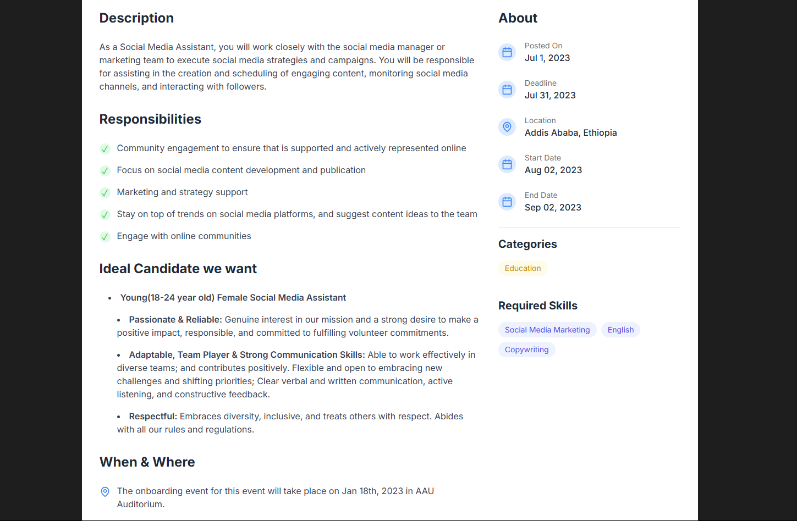

# Job Listing Application

A modern, responsive job listing application built with Next.js and Tailwind CSS. This application allows users to browse job listings, view detailed job descriptions, and filter jobs by various criteria.

## Features

- Browse job listings with a clean, modern UI
- View detailed job descriptions
- Filter jobs by various criteria
- Responsive design for mobile, tablet, and desktop
- Clean, accessible UI with proper spacing and typography

## Technologies Used

- **Next.js** – React framework for server-rendered applications
- **TypeScript** – For type safety and better developer experience
- **Tailwind CSS** – Utility-first CSS framework for styling
- **Lucide React** – For beautiful, customizable icons

## Job Listing Homepage


## Job Detail Page



## How to Run

1. Clone this repository
   ```sh
   git clone https://github.com/ablove/Job_Listing_Application.git
   ```
2. Navigate to the project directory
   ```sh
   cd job-listing-app
   ```
3. Install dependencies
   ```sh
   npm install
   ```
4. Start the development server
   ```sh
   npm run dev
   ```
5. Open your browser and visit [http://localhost:3000](http://localhost:3000)

## Usage Guide

### Browsing Jobs

- The homepage lists available jobs with company logos and job titles.
- Use the filters to refine job searches by categories, type, or location.

### Viewing Job Details

- Click on any job card to see a detailed description.
- The details include job responsibilities, ideal candidate profile, required skills, and company information.

## Project Structure

```
job-listing-app/
├── app/
│   ├── dashboard/
│   │   └── page.tsx         # Dashboard page
│   ├── job/
│   │   └── [id]/
│   │       └── page.tsx     # Job detail page
│   ├── globals.css          # Global styles
│   ├── layout.tsx           # Root layout
│   └── page.tsx             # Home page
├── components/
│   ├── job-card.tsx         # Job card component
│   └── job-description.tsx  # Job description component
├── data/
│   └── job-data.ts          # Static job data
├── public/
│   └── logos/               # Company logos
├── types/
│   └── job.ts               # TypeScript interfaces
├── screenshots/             # Screenshots for README
├── package.json
├── tsconfig.json
├── tailwind.config.js
└── README.md
```

## Future Enhancements

- User authentication and profiles
- Job application functionality
- Advanced search and filtering
- Company profiles
- Job alerts and notifications
- Admin dashboard for job management
- Integration with a backend API for dynamic data

## Contributing

Contributions are welcome! To contribute:

1. Fork the repository
2. Create a feature branch (`git checkout -b feature/amazing-feature`)
3. Commit your changes (`git commit -m 'Add some amazing feature'`)
4. Push to the branch (`git push origin feature/amazing-feature`)
5. Open a Pull Request

## License

This project is licensed under the MIT License - see the LICENSE file for details.
