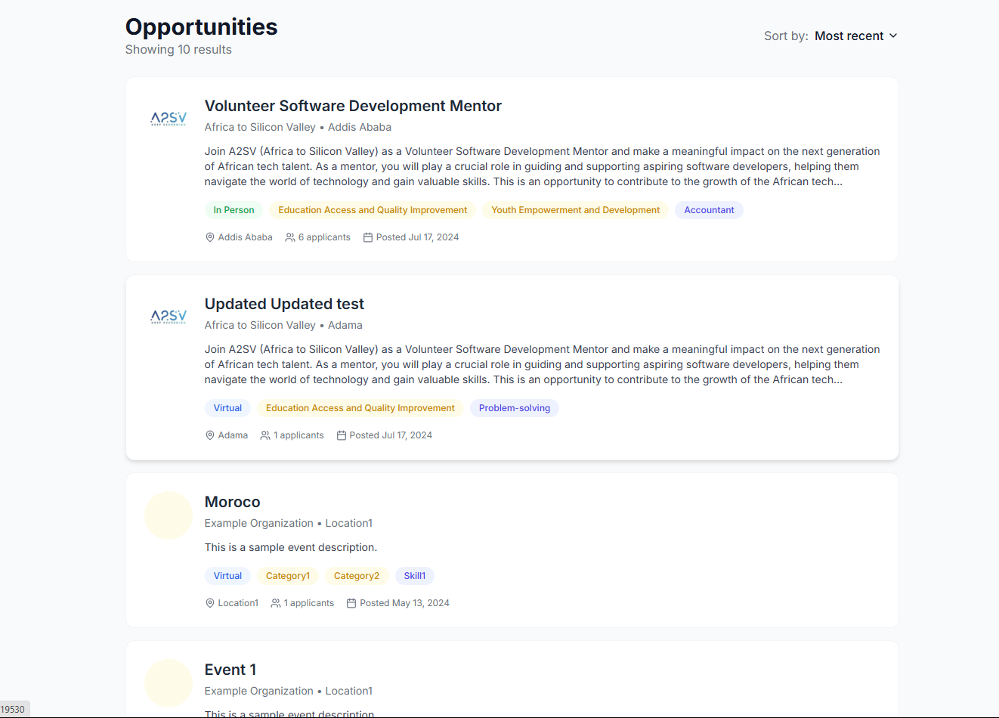
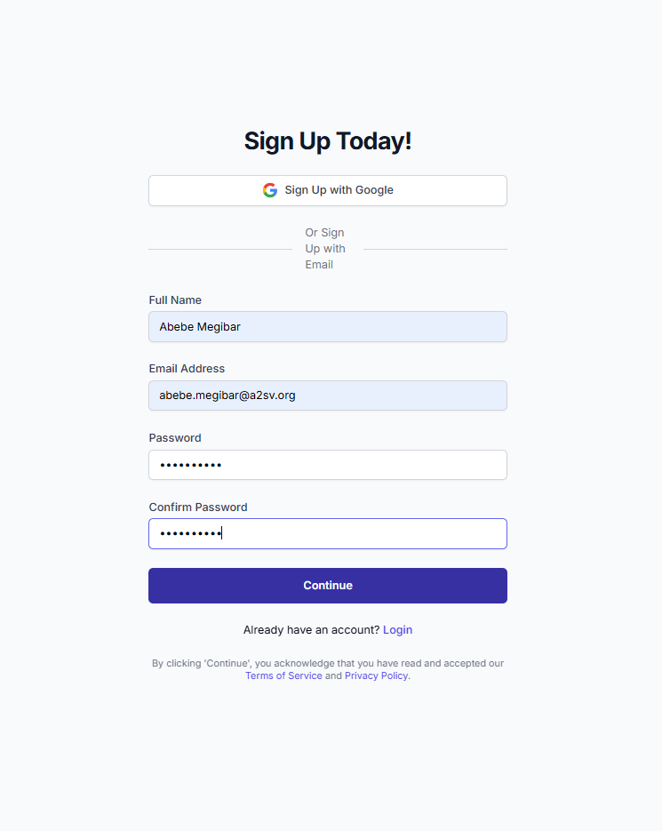
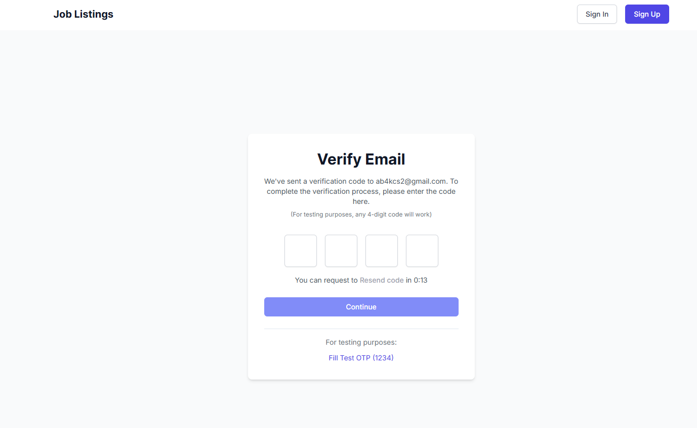
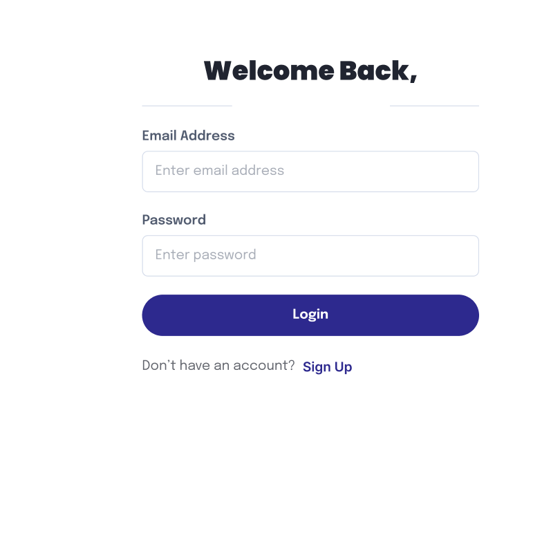

# Job Listing Application with Authentication

A modern, responsive job listing application built with Next.js, Tailwind CSS, RTK Query, and NextAuth.js. This application allows users to browse job opportunities, view detailed job descriptions, and manage their accounts.

## Features

- User authentication (signup, signin, email verification)
- Browse job opportunities from an API
- View detailed job descriptions
- Protected routes for authenticated users
- Responsive design for all devices
- Form validation and error handling
- Secure session management using NextAuth.js

## Screenshots

### Home Page



The home page displays a list of available job opportunities in a clean, card-based layout. Each job card includes:

- Company logo
- Job title
- Company name and location
- Brief job description
- Tags for job categories and type
- Applicant count and posting date

### Sign Up Page



The sign-up page allows new users to create an account by providing:

- Full name
- Email address
- Password (with strength requirements)
- Email verification process

### Email Verification Page



The email verification page ensures that users confirm their email address before accessing their accounts.

### Sign In Page



The sign-in page provides a secure login experience with:

- Email and password authentication
- Error handling for invalid credentials
- Password recovery option

### Job Detail Page


The job detail page provides comprehensive information about a specific job opportunity, including:

- Full job description
- Responsibilities
- Requirements
- Ideal candidate profile
- When and where details
- About section with important dates, location, and other relevant information

## Technical Implementation

### Authentication

The application uses NextAuth.js (v5) for authentication, including:

- Custom credential provider for email/password authentication
- JWT-based session management
- Protected routes with middleware
- Client and server-side session handling

### API Integration

The application integrates with an external API using RTK Query:

- `GET /opportunities/search` - Fetch all job opportunities
- `GET /opportunities/:id` - Retrieve details of a specific job
- `POST /signup` - Register a new user
- `POST /verify-email` - Verify user email with OTP
- `POST /login` - Authenticate a user

### Form Validation

All forms utilize React Hook Form with Zod for validation, ensuring:

- Email format validation
- Password strength enforcement
- Required field validation
- Proper error messaging for invalid inputs

## Getting Started

1. Clone the repository:
   ```sh
   git clone https://github.com/your-repo/job-listing-app.git
   ```
2. Navigate to the project directory:
   ```sh
   cd job-listing-app
   ```
3. Install dependencies:
   ```sh
   npm install
   ```
4. Create a `.env.local` file and add the following environment variables:
   
   ```env
   # Authentication
   AUTH_SECRET=8f9a12b3c4d5e6f7g8h9i0j1k2l3m4n5o6p7q8r9s0t1u2v3w4x5y6z7
   NEXTAUTH_URL=http://localhost:3000
   
   # API URL
   NEXT_PUBLIC_API_URL=https://akil-backend.onrender.com
   ```

5. Start the development server:
   ```sh
   npm run dev
   ```

6. Open [http://localhost:3000](http://localhost:3000) in your browser to view the application.

## Contributing

Contributions are welcome! Please follow these steps:

1. Fork the repository.
2. Create a new branch (`feature-branch-name`).
3. Make your changes and commit them.
4. Push the changes and submit a pull request.

## License

This project is licensed under the MIT License. See the `LICENSE` file for details.

